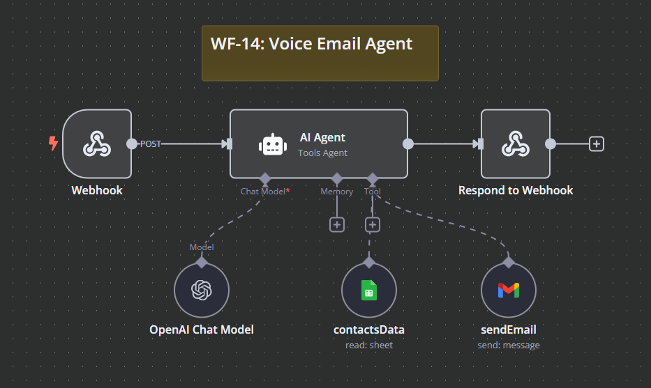

# WF-14: Voice Email Agent – n8n Workflow

## 📌 Overview
This **n8n workflow**, `WF-14: Voice Email Agent`, automates email composition and delivery. It processes email requests via a webhook, retrieves recipient details from Google Sheets, generates a professional email using AI, and sends it via Gmail.

## 🔧 Workflow Components
### 🏗️ Core Modules
1. **🌐 Webhook** – Captures incoming email requests, including recipient and email content.
2. **🤖 AI Agent** – Processes the email request and drafts a professional email.
3. **📜 Google Sheets Contact Lookup** – Retrieves recipient email addresses based on provided names.
4. **📩 Gmail Tool** – Sends the AI-generated email to the recipient.
5. **🔄 Response Handler** – Confirms email delivery.

## ⚙️ How It Works
1. 🌐 The **Webhook** receives an email request containing the recipient's name and message content.
2. 📜 The **Google Sheets Contact Lookup** searches for the recipient’s email address.
3. ✍️ The **AI Agent** drafts a professional email using OpenAI.
4. 📩 The **Gmail Tool** sends the finalized email.
5. ✅ The **Response Handler** confirms successful email delivery.

## 📷 Workflow Screenshot

## 🚀 Setup Instructions
- 📥 **Import the workflow** into `n8n`.
- 🔑 **Ensure API credentials** for OpenAI, Gmail, and Google Sheets are configured.
- ✅ **Activate the workflow** to start sending AI-generated emails.

## 📝 Notes
- ⚠️ The workflow is **inactive by default**.
- 🛠️ Modify AI prompts for different email formats or tones.
- 💡 Can be extended for **voice-based email composition** via speech-to-text integration.
